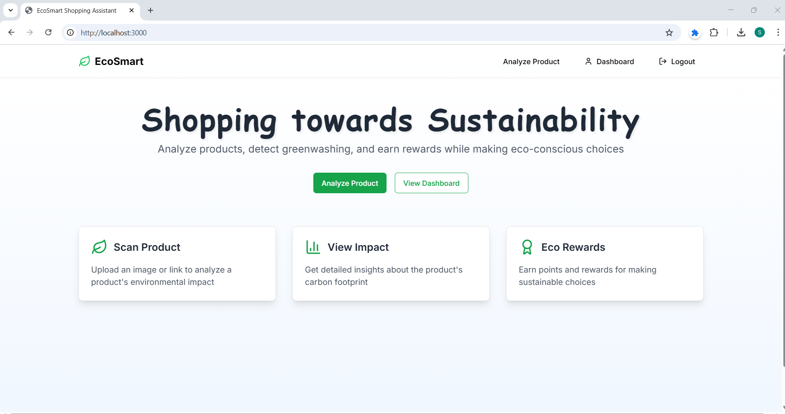

# EcoSmart - Sustainovate'25 (Theme: Miscellaneous)

<p align="center">
  
</p>

## 🌱 Introduction
**EcoSmart** is a sustainability-focused platform designed to encourage eco-friendly shopping habits. It features a **browser extension** that analyzes products on e-commerce websites and assigns an **EcoScore** based on various environmental factors such as waste, plastic usage, and overall environmental impact. If a product has a low score (i.e., is not eco-friendly), it recommends better alternatives.

The **web app** complements this by allowing users to claim rewards based on their EcoPoints, fostering a greener shopping experience.

> 🌍 **"If people stop buying non-natural products, manufacturers will cease production, reducing waste and promoting sustainability for a better future."**

## 🎯 Features
- 🛒 **EcoScore Extension**: Analyzes e-commerce products and rates them based on eco-friendliness.
- ♻️ **Eco-Friendly Recommendations**: Suggests sustainable product alternatives.
- 🎁 **Web App Rewards**: Users can claim rewards based on their accumulated EcoPoints.
- 🌍 **Sustainability Awareness**: Encourages responsible consumption and production.


## 🤔 Why I Chose This Project & How I Generated the Idea
The idea came to my mind because e-commerce is a daily necessity, and in this era, it is crucial to be mindful of our purchases. While I had many options to choose from, I decided to think outside the box and focus on a solution that benefits the world. By selecting this project, I aimed to align with the sustainability theme and contribute to a better future by encouraging responsible consumer behavior.


## 📹 Demo Video
[](https://www.youtube.com/watch?v=dQw4w9WgXcQ)

## 📂 Project Structure
```
backend:
- analyze/
- app.py
- authentication/
- billChecking/

Frontend:
- app/
- hooks/
- components/
- lib/
- public/
- package.json
- next.config.js
- tailwind.config.ts

images:
- DrzwCNdUcAITMVk.jpg
- jj.png
- maxresdefault.jpg
- nothing.png

Web-Extension:
- content.js
- manifest.json
- popup.js
- icons/
- package.json
- tailwind.config.js
- vite.config.ts
```

## ⚡ Setup and Installation
### 1️⃣ Backend Setup
```sh
cd backend
python -m venv env
source env/bin/activate   # On Windows: env\Scripts\activate
pip install -r requirements.txt
```

### 2️⃣ Frontend Setup
```sh
cd Frontend
npm install
npm run dev
```

### 3️⃣ Web Extension Setup
```sh
cd Web-Extension
npm install
```


---
🚀 **Let's make the world greener—one purchase at a time!**
